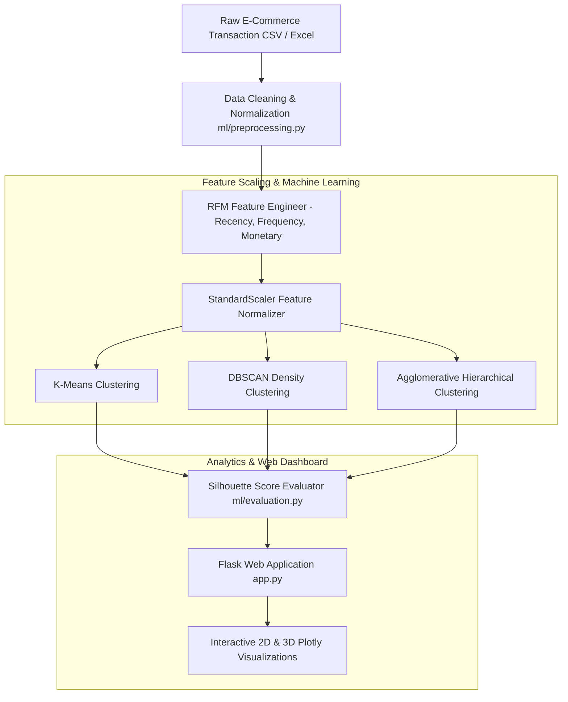

# CustomerSegmentation — E-Commerce Customer Analytics & Machine Learning Clustering Platform

> **Status**: 🔵 Completed Data-Science Project  
> **Target Identity**: CustomerSegmentation  
> **License**: MIT License ([LICENSE](LICENSE))  

CustomerSegmentation is a machine learning analytics platform built with **Python**, **Flask**, **Pandas**, **Scikit-learn**, and **Plotly**, designed to convert e-commerce transaction logs into Recency, Frequency, and Monetary (RFM) customer behavioral profiles using unsupervised clustering models.

---

## Overview

E-commerce businesses need to group customers into behavioral segments (e.g. VIP Champions, Loyal Customers, At-Risk Accounts, Disengaged Buyers) to tailor marketing strategies and prevent churn. **CustomerSegmentation** automates the end-to-end data pipeline: cleaning raw transaction logs, engineering RFM metrics, scaling features with `StandardScaler`, and evaluating unsupervised clustering algorithms (**K-Means**, **DBSCAN**, and **Agglomerative Hierarchical**).

---

## Why I Built It

I built CustomerSegmentation to explore exploratory data analysis (EDA), feature engineering, unsupervised machine learning algorithms, and interactive web dashboard development. Building CustomerSegmentation required handling real-world transaction data anomalies (negative quantities, missing CustomerIDs, duplicate invoices) and evaluating clustering quality using Silhouette coefficient scores.

---

## Architecture & Data Flow



---

## Key Features & Systems Design

- **Automated Data Cleaning Pipeline**: `basic_cleaning` normalizes column headers, converts invoice dates, filters out negative quantities/prices, and drops unassigned customer records.
- **RFM Feature Engineering**: `build_rfm` constructs three core behavioral dimensions per customer:
  - **Recency**: Days elapsed since most recent transaction.
  - **Frequency**: Distinct invoice transaction count.
  - **Monetary**: Aggregate total purchase spend.
- **Multiple Unsupervised ML Algorithms**: Supports tunable K-Means, DBSCAN, and Agglomerative Hierarchical clustering (`ml/clustering.py`).
- **Cluster Evaluation Metrics**: Calculates Silhouette scores and segment distribution stats (`ml/evaluation.py`).
- **Interactive 2D & 3D Visualizations**: Generates dynamic 2D Seaborn/Matplotlib charts and 3D Plotly scatter plots (`ml/visualizations.py`).
- **Export & Session Management**: Session-isolated data processing enabling CSV export of segmented customer lists.

---

## Technical Stack

| Layer | Technologies |
|---|---|
| **Backend & Web Framework** | Python 3.10+, Flask 3.0, Flask-Session |
| **Data Processing & ML** | `pandas`, `numpy`, `scikit-learn`, `joblib` |
| **Data Visualization** | `plotly`, `matplotlib`, `seaborn` |
| **Spreadsheet Ingestion** | `openpyxl`, `xlrd` |
| **Testing & Quality** | Python standard `unittest` framework |

---

## Repository Structure

```
Customer-Segmentation/
├── ml/                         # Machine learning & data engineering modules
│   ├── clustering.py           # K-Means, DBSCAN, & Hierarchical clustering
│   ├── evaluation.py           # Silhouette score & cluster metrics
│   ├── preprocessing.py        # Data cleaning & RFM feature calculation
│   └── visualizations.py       # 2D & 3D plot generators
├── static/
│   └── plots/                  # Generated visualization artifacts
├── templates/                  # Jinja2 HTML templates (upload, select, results)
├── tests/
│   ├── test_segmentation.py    # Basic cleaning, RFM, & K-Means unit tests
│   └── test_evaluation_dbscan.py # DBSCAN, Silhouette evaluation, & invalid data tests
├── app.py                      # Flask application & session routes
├── .env.example                # Safe environment variable configuration template
├── LICENSE                     # MIT License
├── requirements.txt            # Dependency requirements
└── run.bat                     # Windows batch launch script
```

---

## Installation & Setup

### Prerequisites
- Python 3.10+

### Setup Virtual Environment

```bash
# Clone repository
git clone https://github.com/Balu-Annapureddy/CustomerSegmentation.git
cd CustomerSegmentation


# Create virtual environment
python -m venv .venv

# Activate virtual environment
# Windows (PowerShell):
.\.venv\Scripts\Activate.ps1
# Linux/macOS:
# source .venv/bin/activate

# Install dependencies
pip install -r requirements.txt
```

---

## Usage

Launch the Flask web application:

```bash
python app.py
```

Open `http://127.0.0.1:8000` in your browser. Upload an e-commerce transaction dataset (`InvoiceDate`, `CustomerID`, `Quantity`, `UnitPrice`), configure clustering parameters, and inspect the resulting segments.

---

## Testing

Automated unit tests are located in `tests/` (7 unit tests covering data cleaning, RFM calculation, feature scaling, K-Means clustering, DBSCAN, and Silhouette score evaluation).

Run the test suite:

```bash
.\.venv\Scripts\python.exe -m unittest discover tests
```

---

## Security Audit Notice

An audit of source files found no obvious hardcoded credentials. Flask secret key configuration dynamically reads `SECRET_KEY` from environment variables with local development fallbacks.

---

## Limitations

- **Dataset Requirements**: Requires transaction logs containing customer identifiers, timestamps, quantities, and unit prices.
- **Unsupervised Evaluation**: Optimal cluster count (`k`) should be verified using Silhouette scores and domain intuition.

---

## License

This project is licensed under the MIT License — see the [`LICENSE`](LICENSE) file for details.